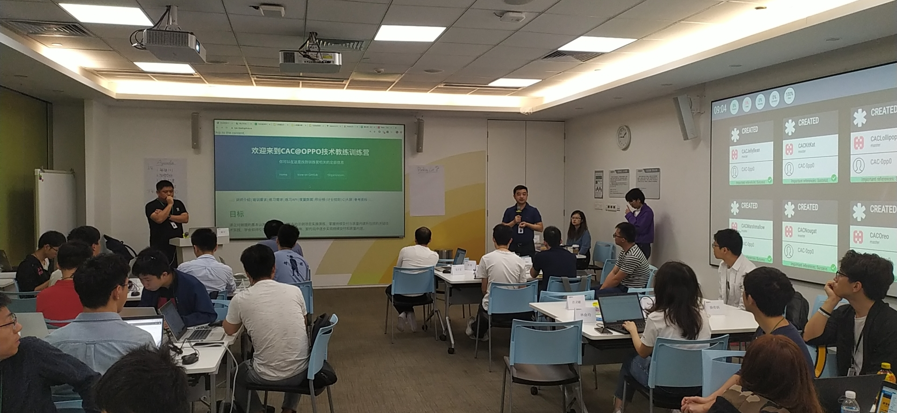
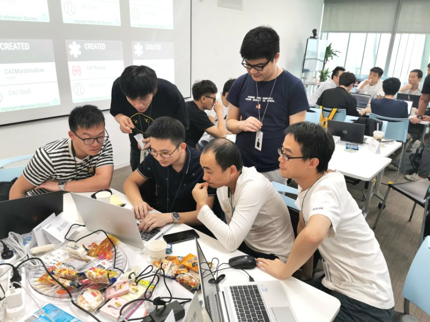
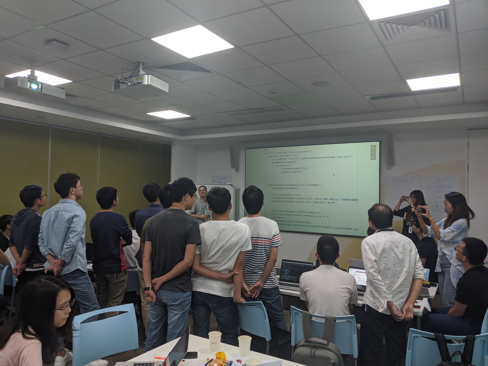
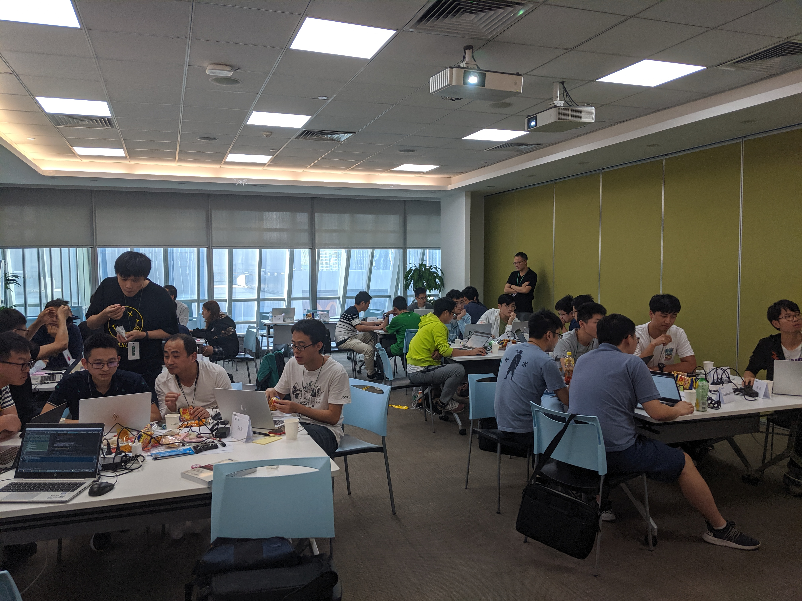
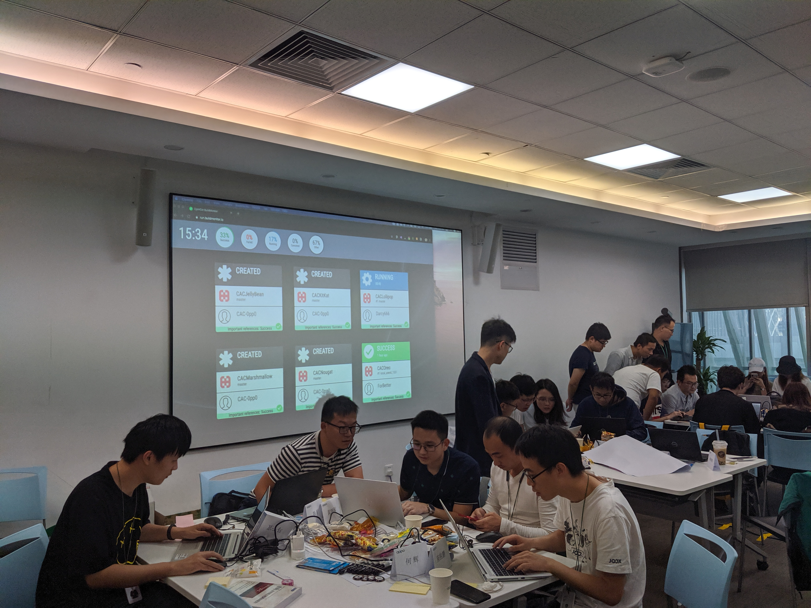

在敏捷方法论中，持续交付和质量内建是不可或缺的实践集，为期三天的 CAC@OPPO 技术教练训练营的目标就是教给大家持续交付和质量内建的基本原则、正确实践以及高效工具。

||
|:---:|
||
|Donny为训练营开营|

和往常的培训不同，本培训设计一个模拟项目，31名学员在4位教练的辅导下，在三天的时间里遵循正确的敏捷技术实践完成模拟项目的练习。学员们实操编写代码，在实战中体会和领悟结对编程、测试驱动开发、集体代码检视、持续重构等技术实践对项目质量和开发效率带来的提升。

|                                          |                                         |                                       |
| :--------------------------------------: | :-------------------------------------: | :-----------------------------------: |
|  |  |  |
|                 结对编程                 |                代码检视                 |               全情投入                |

本次培训全程利用了 GitHub 服务生态，将持续交付和质量内建的度量数据全程可视化。学员们在教练的要求下，通过分析度量数据来发现问题，分析原因并做出改进。学员们在练习中严格遵守持续集成纪律，也明白了正确看待如代码覆盖率这样的度量数据，学会了如何通过度量数据来牵引改进。

## 第一天总结

教练们演示如何对一个需求进行 Tasking（任务分解）
-测试覆盖率
-打结

## 第二天总结

-AS快捷键
-代码检视
-构建失败
-打结

## 第三天总结

-无效测试
-成绩
-打擂，技术热情，拥抱变化，用技术改变世界
-点评，重构时机，结对编程压力，整洁代码，结果
-计划

## 下一步计划
-落地计划
-反馈
-开源&复制
-技术社区

